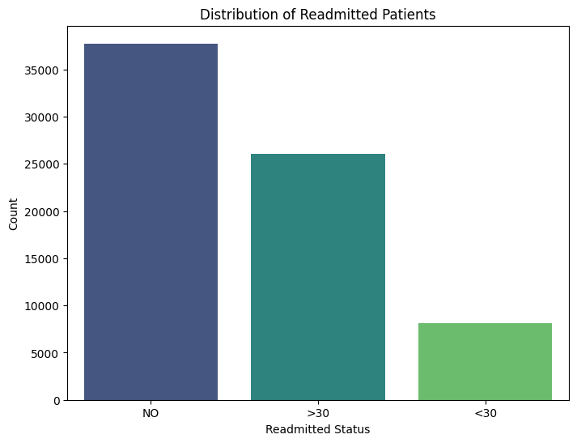
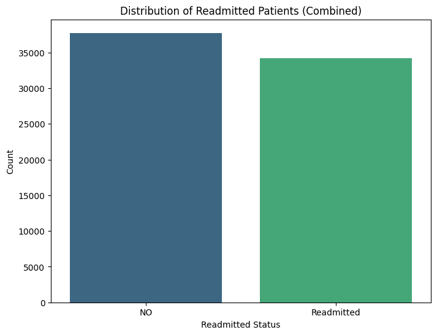
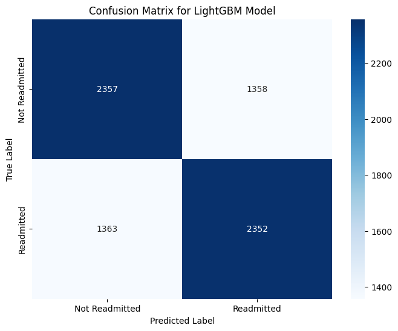
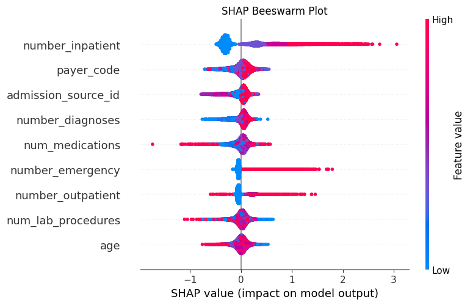
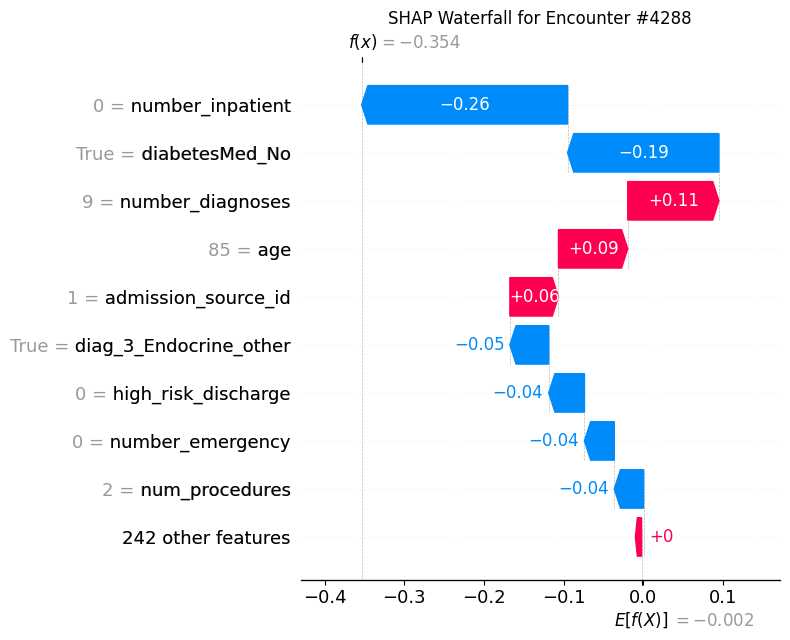

# Diabetes Hospital Readmission Prediction

This project presents a complete machine learning pipeline designed to predict hospital readmission risk for patients with diabetes using the Diabetes 130-US Hospitals dataset. The project combines data preprocessing, exploratory data analysis, predictive modeling, model evaluation, and explainable artificial intelligence (XAI) to create an interpretable and deployment-ready solution. An interactive Streamlit dashboard is included to demonstrate how predictions can be explored in a practical setting.

[](https://diabetes-readmission-dashboard-liwhqp5zv2.streamlit.app/)

---

## Business Problem and Motivation

Hospital readmissions remain a major challenge in the United States healthcare system, particularly among patients with chronic conditions such as diabetes. These readmissions increase healthcare costs, strain hospital resources, and often indicate gaps in care coordination. As discussed in the project report, identifying patients at high risk of readmission allows healthcare providers to intervene earlier and improve patient outcomes. :contentReference[oaicite:0]{index=0}

From a modeling perspective, this problem introduces an important tradeoff. Failing to identify a high-risk patient (false negative) can result in missed intervention opportunities, while incorrectly flagging a low-risk patient (false positive) primarily affects operational workload. For this reason, the modeling approach prioritizes recall over overall accuracy, aligning the model with real-world healthcare decision-making.

---

## Project Overview

This project applies machine learning techniques to predict whether a patient will be readmitted after discharge. The workflow follows a structured pipeline consisting of data preprocessing, exploratory data analysis, model training, evaluation, and deployment. As described in the report, the project builds on earlier work by improving model performance and interpretability while integrating a Streamlit dashboard for interactive exploration. :contentReference[oaicite:1]{index=1}

Multiple machine learning models were evaluated, including Random Forest, XGBoost, Support Vector Machines, and LightGBM. The final model was selected based on its ability to achieve strong recall while maintaining reasonable precision on imbalanced healthcare data. Explainability techniques such as SHAP were incorporated to ensure that predictions remain transparent and clinically meaningful.

---

## Dataset

The dataset used in this project is the Diabetes 130-US Hospitals dataset from the UCI Machine Learning Repository, containing over 100,000 hospital encounters from 130 hospitals between 1999 and 2008. :contentReference[oaicite:2]{index=2}  

- Source: https://archive.ics.uci.edu/ml/datasets/diabetes+130-us+hospitals+for+years+1999-2008  
- Type: Structured clinical and administrative data  
- Size: ~100,000 patient encounters  

The dataset includes patient demographics, laboratory results, medication usage, diagnoses, and healthcare utilization measures such as inpatient, outpatient, and emergency visits. The original target variable contained three classes (no readmission, <30 days, >30 days), which were combined into a binary outcome representing readmitted versus not readmitted to simplify the modeling task and improve class balance. :contentReference[oaicite:3]{index=3}  

---

## Data Preprocessing

Data preprocessing focused on preparing the dataset for reliable machine learning analysis. Irrelevant identifiers were removed, missing values were assessed, and categorical variables were standardized and encoded into numerical representations. The target variable was remapped into a binary classification problem to improve stability and interpretability.

Additional preprocessing steps included feature engineering to capture meaningful relationships in the data, such as interaction features and healthcare utilization patterns. The dataset was then split into training and testing subsets using a stratified approach to preserve class distribution and ensure unbiased evaluation.

---

## Exploratory Data Analysis

Exploratory data analysis was conducted to understand feature distributions, identify data quality issues, and analyze relationships between predictors and readmission outcomes.

### Class Distribution Before Remapping


### Class Distribution After Remapping


The analysis revealed class imbalance in the original dataset and confirmed that healthcare utilization variables, such as prior inpatient and emergency visits, are strongly associated with readmission risk.

---

## Modeling Approach

Multiple machine learning models were evaluated to predict hospital readmission risk, including Logistic Regression (baseline), Random Forest, XGBoost, Support Vector Machines, and LightGBM. These models were selected due to their strong performance on structured tabular data and ability to capture nonlinear relationships.

Among these, LightGBM demonstrated the most consistent performance, particularly in recall-focused evaluation. Its efficiency and ability to handle imbalanced data made it well-suited for this healthcare prediction task.

---

## Model Training

Models were trained using Python-based tools including scikit-learn and LightGBM. The dataset was split into training and testing sets using stratified sampling, and class imbalance was addressed using undersampling techniques.

Model performance was evaluated using precision, recall, and F1-score, with emphasis placed on recall for the readmitted class. Hyperparameters were tuned to balance performance and generalization.

---

## Results

Model evaluation showed that ensemble-based methods performed most consistently, with LightGBM producing the best overall results. The model achieved a recall of approximately 0.65 for the readmitted class, which was further improved through threshold tuning.

### Model Comparison


### Confusion Matrix (Final Model)


After adjusting the classification threshold, recall increased to approximately 0.74, while precision decreased to approximately 0.61. This tradeoff is acceptable in healthcare contexts, where identifying high-risk patients is more critical than minimizing false positives. :contentReference[oaicite:4]{index=4}  

---

## Model Interpretation

To ensure transparency and trust in model predictions, Explainable Artificial Intelligence (XAI) techniques were applied using SHAP.

### Feature Importance


### SHAP Summary Plot


### Local SHAP Explanation


SHAP analysis revealed that healthcare utilization features, particularly the number of inpatient and emergency visits, are the strongest predictors of readmission risk. :contentReference[oaicite:5]{index=5}  

Local SHAP explanations further demonstrate how individual patient predictions are influenced by specific features, allowing users to understand why a patient is classified as high risk.

---

## Key Insights

The results highlight several important findings. First, prior healthcare utilization is the most significant driver of readmission risk, suggesting that historical patient activity plays a critical role in prediction. Second, LightGBM outperformed other models in recall-focused evaluation, making it the most suitable model for this application. Finally, threshold tuning significantly improved recall while maintaining acceptable precision, aligning the model with real-world healthcare priorities.

---

## Conclusion

This project demonstrates how machine learning can be applied to healthcare data to identify patients at risk of hospital readmission. By prioritizing recall and incorporating explainability techniques, the model provides both predictive performance and actionable insights.

The integration of a Streamlit dashboard further illustrates how the model can be deployed as an interactive decision-support tool.

---

## Future Work

Future improvements include exploring multiclass prediction, incorporating additional clinical features, enhancing class imbalance strategies, and expanding fairness analysis across demographic subgroups. Additional work may also focus on integrating real-time data and improving deployment capabilities.

---

## How to Run

1. Install dependencies:
```bash
pip install -r requirements.txt